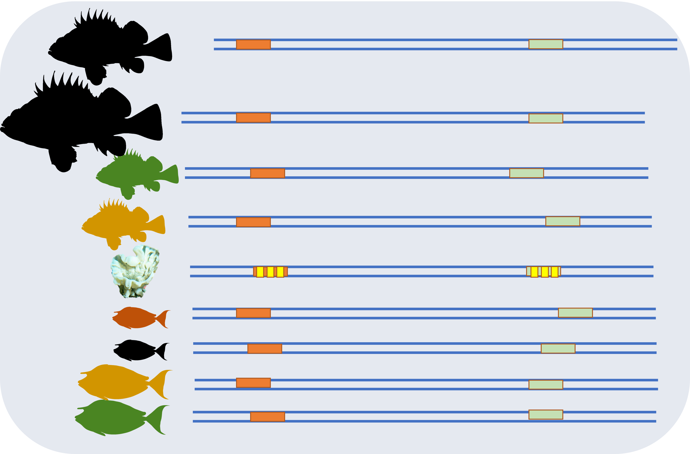

name:bio
class: nord-dark, center


background-image: linear-gradient(150deg,rgba(46, 52, 64, 10%),rgba(46, 52, 64, 20%),rgba(46, 52, 64, 20%),rgba(46, 52, 64, 10%)), url(images/seafloow.png)

background-size: cover


# .huge[.nord1[*Tales*] .nord4[*from the deep:*]]

## .nord1[*using s*].nord4[*ponges to survey deep water ecosystems*]


```{css, echo=F}
.small { font-size: 70% }
.huge  { font-size: 120% }
```


.footnote[

</br>
</br>
</br>

.content-box-purple[

.nord1[

**Ramón Gallego**, **Belen Arias**, Cristina Díaz, Erika Neave, Cai Wang, Peter Shum, Paco Cárdenas,
Karin  Steffen, Sergi Taboada, Adriana Villamor, Jim Drewery, Stefano Mariani and Ana Riesgo


]
]
]

```{r setup, include=FALSE, message=F, echo=FALSE}
options(htmltools.dir.version = FALSE)
library (leaflet)
library(tidyverse)
library(here)
library(kableExtra)
library(DT)
```

```{css echo=FALSE}
.highlight-last-item > ul > li,
.highlight-last-item > ol > li {
  opacity: 0.5;
}
.highlight-last-item > ul > li:last-of-type,
.highlight-last-item > ol > li:last-of-type {
  opacity: 1;
}

.bold-last-item > ul > li:last-of-type,
.bold-last-item > ol > li:last-of-type {
  font-weight: bold;
}
```
---
name: The Deep Sea Benthos
background-image: linear-gradient(150deg,rgba(46, 52, 64, 10%),rgba(46, 52, 64, 20%),rgba(46, 52, 64, 20%),rgba(46, 52, 64, 10%)), url(images/deep_sea.jpg)
background-position: top
background-size: cover
class: nord-light

## .nord4[The Deep Sea Benthos]


</br>

.pull-left[
.content-box-purple[

 * .huge[.nord1[.bold[60% of the Earth surface]]]

]


 .content-box-purple[

 * .huge[.nord1[.bold[Great Gaps in Biodiversity knowledge]]]

]


  .content-box-purple[

 * .huge[.nord1[.bold[Urgency to know to face two challenges:]]]

]

 ]
--

.pull-right[

.content-box-purple[

 * .huge[.nord1[.bold[ Increasing human pressure ]]]]
 
.content-box-purple[ * .huge[.nord1[.bold[Global Warming]]]

]

]

---
name: Type of Benthic habitats
background-image:  url(images/deep_sea.jpg)
background-position: top
background-size: cover
class: nord-light

## .nord4[The Deep Sea Benthos]

--

### .nord4[More than mud]

---
name: Type of Benthic habitats
background-image:  url(images/othercosystems.png)
background-position: top
background-size: cover
class: nord-light

## .nord4[The Deep Sea Benthos]


### .nord4[More than mud]

---
name: Sponge Grounds
background-image:  url(images/SpGround_full.png)
background-position: center
background-size: contain
class: nord-dark


---
name: Sponge Grounds
background-image:  url(images/sponge_ground.png)
background-position: bottom
background-size: contain
class: nord-dark

## .nord4[Sponge Grounds]

--

.content-box-purple[

 * .huge[.nord1[.bold[Broad distribution]]]

]
---
name: Sponge Ground distribution
background-image:  url(images/Slide10.png)
background-position: bottom
background-size: contain
class: nord-dark

## .nord4[Sponge Grounds]

---
name: Sponge Grounds
background-image:  url(images/sponge_ground_transparent.png)
background-position: bottom
background-size: contain
class: nord-dark

## .nord4[Sponge Grounds]


--

.content-box-purple[

 * .nord1[Broad distribution]
 
 * .huge[.nord1[.bold[Enriched Habitat]]]

]

--
</br>

.center[

]

---
name: Sponge Grounds
background-image:  url(images/sponge_ground.png)
background-position: bottom
background-size: contain
class: nord-dark

## .nord4[Sponge Grounds]


.content-box-purple[

 * .nord1[Broad distribution]
 
 * .nord1[Enriched Habitat]
 
 * .huge[.nord1[.bold[Threatened]]]

]

---
name: How to investigate
background-image:  url(images/Slide11.png)
background-position: bottom
background-size: contain
class: nord-dark

## .nord4[Sponge Grounds]
</br>

.content-box-yellow[
.huge[.nord1[.bold[How to research the diversity they hold]]]

]

---
name: Can we use eDNA
background-image:  linear-gradient(150deg,rgba(46, 52, 64, 10%),rgba(46, 52, 64, 20%),rgba(46, 52, 64, 20%),rgba(46, 52, 64, 10%)), url(images/eDNA_concept.png)
background-position: bottom
background-size: contain
class: nord-dark

# .nord4[eDNA]

--

.pull-left[
.content-box-yellow[
* .huge[.nord1[.bold[.center[Easier way to capture DNA]]]]

* .huge[.nord1[.bold[.center[Will get DNA from potentially all taxa]]]]
]
]

--
.pull-right[
.content-box-purple[
* .huge[.nord1[.bold[.center[Relatively low volumes]]]]

* .huge[.nord1[.bold[.center[Here and now]]]]
]
]

---
name: Can we use nsDNA
background-image:  linear-gradient(150deg,rgba(46, 52, 64, 10%),rgba(46, 52, 64, 20%),rgba(46, 52, 64, 20%),rgba(46, 52, 64, 10%)), url(images/eDNA_concept.png)
background-position: bottom
background-size: contain
class: nord-dark

# .nord4[eDNA]


---
name: Use the sponge

class: nord-dark

<video width=1200 height=800 controls>

<source src="images/transition1.mp4" type="video/mp4">
</video>

---
name: Can we use nsDNA
background-image:  linear-gradient(150deg,rgba(46, 52, 64, 10%),rgba(46, 52, 64, 20%),rgba(46, 52, 64, 20%),rgba(46, 52, 64, 10%)), url(images/sponge_icon.png)
background-position: 10%
background-size: 300px 300px
class: nord-dark


.content-box-yellow[
.center[##.nord1[.center[nsDNA ]]]]
</br>
</br>

.pull-right[

.content-box-purple[

* .huge[.nord1[.bold[.center[DNA extraction from sponge tissue]]]]


* .huge[.nord1[.bold[.center[Contains DNA from the sponge and everything it eats 
]]]]


* .huge[.nord1[.bold[.center[Represents 100s or 1000s of L of seawater 
]]]]

]

]

---
name: It works on Fish
background-image: url(images/Slide12.png)
background-position: top
background-size: contain
class: nord-dark

.content-box-yellow[
.center[##.nord1[.center[nsDNA ]]]]


</br>
</br>
</br>
</br>

.content-box-purple[

.huge[.nord1[.bold[.center[Using Fish-specific primers ]]]]
]
.center[

]
---

name: Can it work community-wide
background-image:  linear-gradient(150deg,rgba(46, 52, 64, 10%),rgba(46, 52, 64, 20%),rgba(46, 52, 64, 20%),rgba(46, 52, 64, 10%)), url(images/sponge_ground_transparent.png)
background-position: left
background-size: contain
class: nord-dark
.content-box-yellow[
  .center[##.nord1[.center[nsDNA]]]]
</br>

.content-box-purple[

.huge[.nord1[.bold[.center[Can it work  whole communities? ]]]]
]


---
name: Our Paper
background-size: cover
class: nord-dark
background-image: url(images/Slide13.png)

---

background-image:  linear-gradient(150deg,rgba(46, 52, 64, 10%),rgba(46, 52, 64, 20%),rgba(46, 52, 64, 20%),rgba(46, 52, 64, 10%)), url(images/sponge_ground_transparent.png)
background-position: left
background-size: contain
class: nord-dark


</br>
</br>

.content-box-blue[
```{r dataTABLE12, echo = F, warning=FALSE ,message=FALSE, out.height='70%', out.width='70%'}

dataset <- read_csv(here("data","final_metadata.csv"))

dataset |> 
  group_by(Species, Biogeographic_region) |> 
  summarise (nsamples = as.character(n())) |> 

  pivot_wider(names_from = Biogeographic_region, values_from = nsamples ,values_fill = "-") -> tableready

tableready |> 
    kable() %>%
    kable_styling(full_width = F) %>%
       column_spec(1, italic  = T) |> 
  column_spec(2:5, width = "10em") |> 
  scroll_box(width = "600px")


```
]
---
background-image: url(images/mapa1.png)
background-position: center
background-size: contain
class: nord-dark

---
background-image: url(images/mapa2.png)
background-position: center
background-size: contain
class: nord-dark

---
background-image: url(images/mapa3.png)
background-position: center
background-size: contain
class: nord-dark

<!-- --- -->

<!-- class: nord-dark -->
<!-- name: Research plan -->

<!-- ##.center[.fancy[.title[Experimental design]]] -->
<!-- ```{r, message = F, echo = F, out.width= '90%'} -->


<!-- leaflet(data = read_csv(here("data","final_metadata.csv"))) %>%  -->
<!--   addTiles() |> -->
<!--   # addProviderTiles(providers$CartoDB) %>% -->
<!--   setView(lat = 60, lng = -3.5, zoom = 5) %>%  -->
<!--   addMarkers(label = ~Species,  -->
<!--              labelOptions = labelOptions(interactive = FALSE, clickable = NULL, noHide = NULL, -->
<!--                                          permanent = FALSE, className = "", direction = "auto", -->
<!--                                          offset = c(1, 1), opacity = 1, textsize = "20px", -->
<!--                                          textOnly = FALSE, style = NULL, sticky = TRUE, ), -->
<!--              popup = ~as.character(Depth) -->
<!--   ) -->

<!-- ``` -->

---

background-image:  linear-gradient(150deg,rgba(46, 52, 64, 10%),rgba(46, 52, 64, 20%),rgba(46, 52, 64, 20%),rgba(46, 52, 64, 10%)), url(images/sponge_ground_transparent.png)
background-size: cover
class: nord-dark
name: Research plan
##.center[.fancy[.title[Experimental design]]]

.content-box-purple[

.huge[.nord1[.bold[.center[Amplifying COI with Leray primers]]]]
]

--

</br>

.content-box-purple[

.huge[.nord1[.bold[.center[Sequencing 97 samples in a MiSeq]]]]
]

--
</br>
.content-box-purple[

.huge[.nord1[.bold[.center[Denoising with DADA2]]]]
]

--
</br>
.content-box-purple[

.huge[.nord1[.bold[.center[Second clustering with swarm]]]]
]

--
</br>
.content-box-purple[

.huge[.nord1[.bold[.center[BLAST and LCA for taxonomical assignment]]]]
]
--
</br>
.content-box-purple[

.huge[.nord1[.bold[.center[Further curation by taxonomic experts]]]]
]

---
background-image:  linear-gradient(150deg,rgba(46, 52, 64, 10%),rgba(46, 52, 64, 20%),rgba(46, 52, 64, 20%),rgba(46, 52, 64, 10%)), url(images/sponge_ground_transparent.png)
background-size: cover
class: nord-dark
name: results

##.center[.fancy[.title[Results]]]


.content-box-purple[

.huge[.nord1[.bold[.center[14.26M raw reads from 97 samples]]]]
]

--
</br>
.content-box-purple[

.huge[.nord1[.bold[.center[After QC, ~ 9M reads from 11,198 ASVs ]]]]
]

--

</br>
.content-box-purple[

.huge[.nord1[.bold[.center[Assigned taxonomy: 7.6M reads, 2155 ASVs  ]]]]
]
--
.content-box-nord-light[

]


---
background-image:  linear-gradient(150deg,rgba(46, 52, 64, 10%),rgba(46, 52, 64, 20%),rgba(46, 52, 64, 20%),rgba(46, 52, 64, 10%)), url(images/sponge_ground_transparent.png)
background-size: cover
class: nord-dark
name: results

##.center[.fancy[.title[nsDNA Results ]]]

.content-box-purple[

.huge[.nord1[.bold[.center[**Only** 1.8M reads from 590 species]]]]
]

--
.content-box-purple[

.huge[.nord1[.bold[.center[Leray primers target Metazoa, most reads and species belong to: Chordata, Cnidaria, Echinodermata and Porifera   ]]]]
]

--
.content-box-purple[
```{r, message = F, echo = F, out.width= '90%'}

read_csv(here("data", "TalkCISA2023_summary.csv")) -> summary_CISA

colnames(summary_CISA) <- gsub("\\...*", "", colnames(summary_CISA))
kbl(summary_CISA, align = "c") %>%
  kable_classic(full_width = F, html_font = "Cambria") %>%
  add_header_above(c("","All together " =  5 , "Phakellia ventilabrum " = 3 ,"Geodia hentscheli" = 3,  "Geodia barretti" = 3, "Geodia parva" = 3), italic = T, bold = T) |> 
  scroll_box(width = "800px")
```
]
---

background-image:  linear-gradient(150deg,rgba(46, 52, 64, 10%),rgba(46, 52, 64, 20%),rgba(46, 52, 64, 20%),rgba(46, 52, 64, 10%)), url(images/sponge_ground_transparent.png)
background-size: cover
class: nord-dark
name: results

##.center[.fancy[.title[Echinoderms ]]]

.content-box-purple[

.huge[.nord1[.bold[.center[78 ASVs, 43 species, 117k reads]]]]
]


---

background-image:  linear-gradient(150deg,rgba(46, 52, 64, 10%),rgba(46, 52, 64, 20%),rgba(46, 52, 64, 20%),rgba(46, 52, 64, 10%)), url(images/sponge_ground_transparent.png)
background-size: cover
class: nord-dark
name: results

##.center[.fancy[.title[Cnidarians ]]]

.content-box-purple[

.huge[.nord1[.bold[.center[166 ASVs, 86 species, 83k reads]]]]
]


---

background-image:  linear-gradient(150deg,rgba(46, 52, 64, 10%),rgba(46, 52, 64, 20%),rgba(46, 52, 64, 20%),rgba(46, 52, 64, 10%)), url(images/sponge_ground_transparent.png)
background-size: cover
class: nord-dark
name: results

##.center[.fancy[.title[Porifera (no host) ]]]

.content-box-purple[

.huge[.nord1[.bold[.center[189 ASVs, 87 species, 68k reads]]]]
]


---

background-image:   url(images/cordata_all.png)
background-size: contain
class: nord-light
name: results

##.center[.fancy[.title[Chordata ]]]

---

background-image:   url(images/sponge_ground.png)
background-size: cover
class: nord-light
name: Conclusions

##.center[.fancy[.title[.nord4[A few thoughts ]]]]

--

</br>
.content-box-purple[

.huge[.nord1[.bold[.center[A good way to describe diversity]]]]

]
.content-box-nord-light[

]
---

background-image:   url(images/sponge_ground.png)
background-size: cover
class: nord-light
name: Conclusions

##.center[.fancy[.title[.nord4[A few thoughts ]]]]

</br>
.content-box-purple[

.huge[.nord1[.bold[.center[ _Phakelia_ much better at this]]]]

]
.center[
.content-box-yellow[
.huge[.nord1[.bold[.center[Depth related?]]]]
]
.content-box-nord-light[


]

]

---

background-image:   url(images/sponge_ground.png)
background-size: cover
class: nord-light
name: Conclusions

##.center[.fancy[.title[.nord4[A few thoughts ]]]]

</br>
.content-box-purple[

.huge[.nord1[.bold[.center[ _Phakelia_ much better at this]]]]

]
.center[
.content-box-yellow[
.huge[.nord1[.bold[.center[Microbiome of _Geodia_ interfering?]]]]
]
.content-box-nord-light[

]
]

---

background-image:   url(images/sponge_ground.png)
background-size: cover
class: nord-light
name: Conclusions

##.center[.fancy[.title[.nord4[A few thoughts ]]]]

</br>
.content-box-purple[

.huge[.nord1[.bold[.center[ _Phakelia_ much better at this]]]]

]
.center[
.content-box-yellow[
.huge[.nord1[.bold[.center[Primer Affinity?]]]]
]


---

background-image:   url(images/Thanks.png)
background-size: contain
background-position: bottom
class: nord-light
name: results

#.center[.fancy[.title[Funding]]]

---
background-image:   url(images/sponge_ground_transparent.png)
background-size: cover
background-position: bottom
class: nord-light
name: results

#.center[.fancy[.title[.nord4[Thanks!]]]]
.content-box-yellow[
.huge[.nord1[.bold[
 Ana Riesgo & MNCN group

 </br>
 
 Belen Arias
 </br>
 Stefano Mariani and team
 </br>
 Crew and sampling team
 </br>
 Ana Ramón-Laca
 </br>
 Environmental Genomics group at UAM
]]]
]
